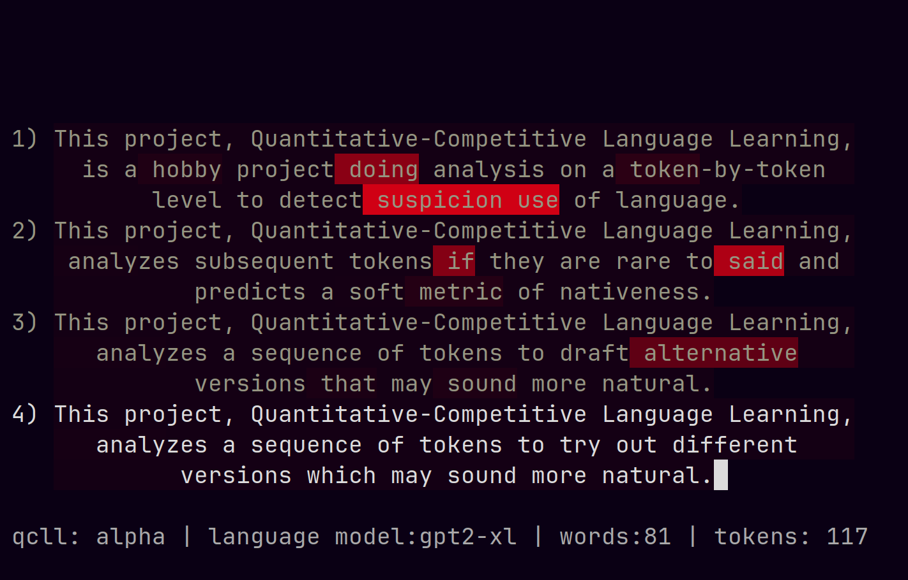

# Quantitative-Competitive Language Learning

This is a toy project aiming to use a LLM as a *model-of-language*. That might seem redundant, but what I mean by that is I care about the actual distribution over tokens, not the sampling/generative procedure that LLMs are typically synonymous with. Given a distribution of tokens, I compute an approximate branching factor using the perplexity of the distribution and compare it with the user-supplied token probability; this gives a soft estimate for whether or not the model regards the next token as one of the possible continuations of the context preceding it. For example, if the branching factor is 40 but the token's probability is much less than 1/40 there's probably something weird going on.

What's so competitive about this? Well, my vision is to be able to place users on a distribution that spans from noise, then to language-learners, then natives, then to the model itself. The key is to derive a stable metric which corresponds to "yeah, this sentence is plausibly written by a native"; something I think is possible if enough care is taken to normalize over the relative probability of equally-viable but not equally-likely tokens. With that, users could get empirical feedback and track their progress as they learn a foreign language and even compete with each other to produce the most or "highest quality" text. 

